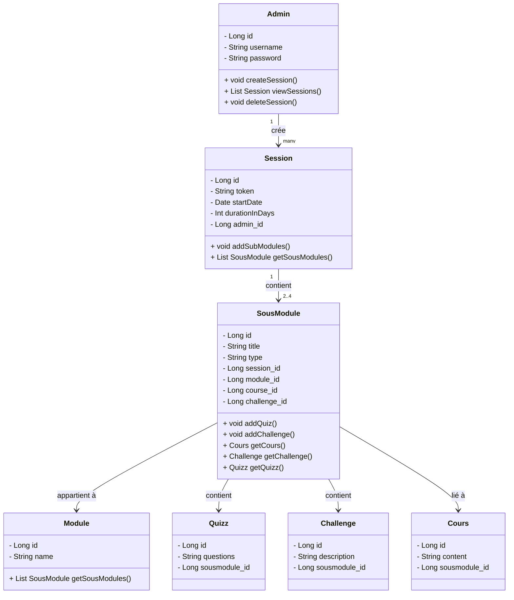

# 📄 Documentation Fonctionnelle de l’Application Web **CyberChall**

## ✅ Sommaire

1. [Introduction](#1-🎯-introduction)  
2. [Objectifs de l’Application](#2-🎯-objectifs-de-lapplication)  
3. [Fonctionnalités Principales](#3-🧩-fonctionnalités-principales)  
   - [3.1 Modules de Sensibilisation](#31-📚-modules-de-sensibilisation)  
   - [3.2 Gestion des Sessions](#32-🧭-gestion-des-sessions)  
     - [3.2.1 Sessions Temporaires via QR Code](#321-sessions-temporaires-via-qr-code)  
   - [3.3 Résultats et Suivi de Progression](#33-📊-résultats-et-suivi-de-progression)  
   - [3.4 Gestion des Utilisateurs](#34-👥-gestion-des-utilisateurs)  
   - [3.5 Authentification et Sécurité](#35-🔐-authentification-et-sécurité)  
   - [3.6 Interface Utilisateur (UI)](#36-🎨-interface-utilisateur-ui)  
4. [Parcours Utilisateur](#4-👣-parcours-utilisateur)  
5. [Technologies Utilisées](#5-🛠-technologies-utilisées)  
6. [Évolutions Possibles](#6-🚀-évolutions-possibles)  
7. [Conclusion](#7-🧩-conclusion)

---

## 1. 🎯 Introduction

**CyberChall** est une application web pédagogique développée pour initier les collégiens et lycéens aux bonnes pratiques en cybersécurité.  
Elle combine des contenus théoriques, des quiz (V1) et des challenges interactifs (V2).

Développée avec **Spring Boot** elle permet de suivre la progression des utilisateurs et de gérer les sessions pédagogiques.

---

## 2. 🎯 Objectifs de l’Application

- Sensibiliser les élèves aux enjeux de la cybersécurité.  
- Évaluer leurs connaissances via des modules interactifs.  
-   

---

## 3. 🧩 Fonctionnalités Principales

### 3.1 📚 Modules de Sensibilisation

Chaque module comprend :  
- ✅ Du contenu explicatif sur les risques numériques *(V1)*  
- ❓ Un quiz à choix multiples *(V1)*  
- 🔐 Un challenge ou mini-simulation *(V2)*  

**Exemples de modules :**
- Protection des données  
- Réseaux sociaux  
- Sécurité des appareils  
- Cyberattaques courantes  

---

### 3.2 🧭 Gestion des Sessions

- Création de sessions (date, thématiques sélectionnées, lien et QR Code)  
- Liste des sessions disponibles dans un dashboard  
- Participation à une session existante  
- Durée de vie d'une session : 1 mois  

### 🔧 Diagramme UML - Architecture des Entités

---

### 3.3 📊 Résultats et Suivi de Progression (V2)

- Score global par session  
- Détail des résultats par module  
- Historique des participations  
- Statistiques exportables (CSV à terme)  

---

### 3.4 👥 Gestion des Utilisateurs

- Admin (cadettes) 
- Liste des élèves connectés  
- Association élèves ↔ sessions  
- Accès restreint à certains modules selon session  

---

### 3.5 🔐 Authentification et Sécurité

- Session via QrCode 
- Authentification sans créaion de compte pour les élèves 
- Authentification sécuriée pour les Admin (hashage mdp) 

---

### 3.6 🎨 Interface Utilisateur (UI)

- Responsive design (desktop/tablette/mobile)  
- Interface épurée 
- Couleurs en cours de révision pour harmonisation avec le site officiel du PEC  

---

## 4. 👣 Parcours Utilisateur

### 👩‍🎓 Élève

1. Scanne un QR code / clique sur un lien  
2. Atterrit sur une page temporaire  
3. Accède aux modules (cours + quiz + challenge)  
4. Visualise un résumé de sa performance à la fin (V2)

### 👨‍🏫 Administrateur

1. Se connecte via `/login`  (ou création de compte)
2. Accède à l’interface admin :  
   - Créer une session temporaire  
   - Gérer les modules  
   - Voir les statistiques (V2)

---

## 5. 🛠 Technologies Utilisées

| Composant        | Technologie         |
|------------------|---------------------|
| Backend          | Spring Boot (Java)  |
| Frontend         | Thymeleaf, HTML/CSS/JavaScript |
| Authentification | identifiants (admin) ou Session (élèves) |
| Build            | Maven               |
| Base de données  | MySql |

---

## 6. 🚀 Évolutions Possibles

- Création de comptes élèves  
- Sécurisation avancée (Spring Security)  
- Dashboard statistiques dynamiques  
- Ajout de badges, niveaux, timers (gamification)  
- Export PDF ou CSV des performances  

---

## 7. 🧩 Conclusion

**CyberChall** est un outil pédagogique, conçu pour sensibiliser les jeunes aux enjeux de cybersécurité.  
Son interface intuitive et son contenu progressif en font un levier d'apprentissage ludique et efficace.

---

> 🛠 *Projet open-source à vocation éducative. Contributions bienvenues via issues ou pull requests sur le dépôt GitHub.*
